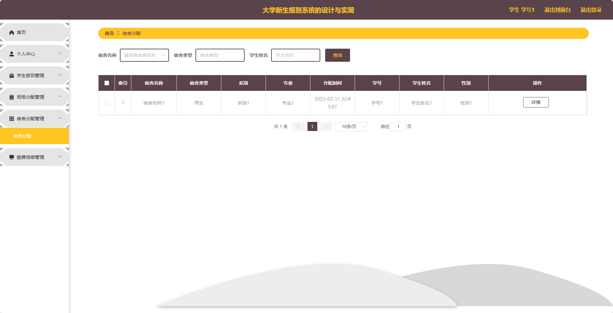

基于SpringBoot的大学新生报到系统（程序+论文）
=
- 完整代码获取地址：从戎源码网 ([https://armycodes.com/](https://armycodes.com/))
- 作者微信：19941326836  QQ：952045282 
- 承接计算机毕业设计、Java毕业设计、Python毕业设计、深度学习、机器学习
- 选题+开题报告+任务书+程序定制+安装调试+论文+答辩ppt 一条龙服务
- 所有选题地址https://github.com/nature924/allProject

一、项目介绍
---
基于Spring Boot框架实现的大学新生报到系统，系统包含两种角色：管理员、用户,系统分为前台和后台两大模块，主要功能如下。

### 前台功能：
- 首页：展示平台的概况、报道流程信息等内容。
- 报道流程：展示报到流程的各个步骤和要求。
- 校园公告：展示学校的最新公告和资讯。
- 后台管理：跳转到管理员登录页面。

### 后台功能：
### 管理员：
- 个人中心：管理个人信息和账户。
- 学生管理：管理学生信息，包括新增、编辑、删除学生信息。
- 报道流程管理：管理报到流程的各个步骤和要求，包括新增、编辑、删除流程步骤。
- 学生报到管理：查看学生报到情况，包括审核、确认报到状态等操作。
- 班级分配管理：管理学生的班级分配，包括新增、编辑、删除班级信息。
- 宿舍分配管理：管理学生的宿舍分配，包括新增、编辑、删除宿舍信息。
- 缴费信息管理：管理学生的缴费情况，包括查看、确认缴费状态等操作。
- 学生信息管理：管理学生的个人信息，包括新增、编辑、删除学生信息。
- 班级信息管理：管理班级的信息，包括新增、编辑、删除班级信息。
- 宿舍信息管理：管理宿舍的信息，包括新增、编辑、删除宿舍信息。
- 系统管理：管理系统的基础数据和配置，包括管理员账号、权限设置等。

### 学生：
- 个人中心：管理个人信息和账户。
- 学生报到管理：查看报到状态，填写并提交个人信息以完成报到流程。
- 班级分配管理：查看班级分配情况。
- 宿舍分配管理：查看宿舍分配情况。
- 缴费信息管理：查看缴费情况。

二、项目技术
---
- 编程语言：Java
- 数据库：MySQL
- 项目管理工具：Maven
- 前端技术：VUE、HTML、Jquery、Bootstrap
- 后端技术：Spring、SpringMVC、MyBatis

三、运行环境
---
- 操作系统：Windows、macOS都可以
- JDK版本：JDK1.8以上都可以
- 开发工具：IDEA、Ecplise、Myecplise都可以
- 数据库: MySQL5.7以上都可以
- Tomcat：任意版本都可以
- Maven：任意版本都可以

四、运行截图
---
### 论文截图：

### 程序截图：

